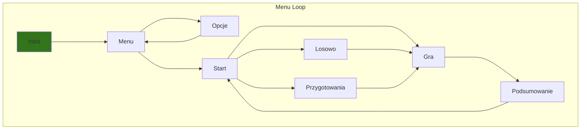

# Battleships

## Wygląd menu


Przygotowania:
- Poziom trudności  
- Rozmieszczenie statków
<!-- Planowane do dodania:
- Ilość statków
- Rozmiar planszy  -->

<!-- ## Rozgrywka

Pixelarty statków, spray wybuchu

Celownik przesuwany za pomocą przytrzymywania lewym przyciskiem myszy, przesuwania boxa z kursorem, brania pozycji środka blocku z celownikiem do wybierania w który statek strzelamy
```python 
elif event.type == MOUSEBUTTONUP:
            moving = False
            print(f'Position: {event.pos}') # working get postion of movable crosshair
```
ewentualnie zrobić tak żeby obraz przesuwał się do kolejnego naciśnięcia lewego przycisku czyli
```python
event.type == MOUSEBUTTONDOWN:

```

jeżeli left click 1 raz
    moving = True
    jeżeli left click 2 raz
        moving = False

Chyba skorzystam z prostego trzymania left clicka.
 -->

<!-- ## Paleta kolorów -->

<!-- ## Poziom trudności -->

<!-- ## Menu:

- Zagraj
    - Poziom trudności  
    - Rozmiar planszy
    - Ilość statków
    - Ułożenie statków
- Opcje
    - Rozmiar ekranu (działa po restarcie?)
    - Paleta kolorów
- Wyjście -->

<!-- ## Domyślna paleta kolorów -->
<!-- #fffaff, #d8315b, #0090c1, #003459, #ac7b84 -->
  <!-- <color name="Ghost White" hex="fffaff" r="255" g="250" b="255" />
  <color name="Cerise" hex="d8315b" r="216" g="49" b="91" />
  <color name="Blue NCS" hex="0090c1" r="0" g="144" b="193" />
  <color name="Prussian Blue" hex="003459" r="0" g="52" b="89" />
  <color name="English Lavender" hex="ac7b84" r="172" g="123" b="132" /> -->

-  `#fffaff`
-  `#d8315b`
-  `#0090c1`
-  `#003459`
-  `#ac7b84`

## Napisane na:

- Python 3.11.0
- Pygame 2.1.3.dev8

## Disclaimer

This is a learning project, nothing commercial. If you are an author of any music used here and want it deleted feel free to contact me.

> Zaktualizowano 29.11.2022